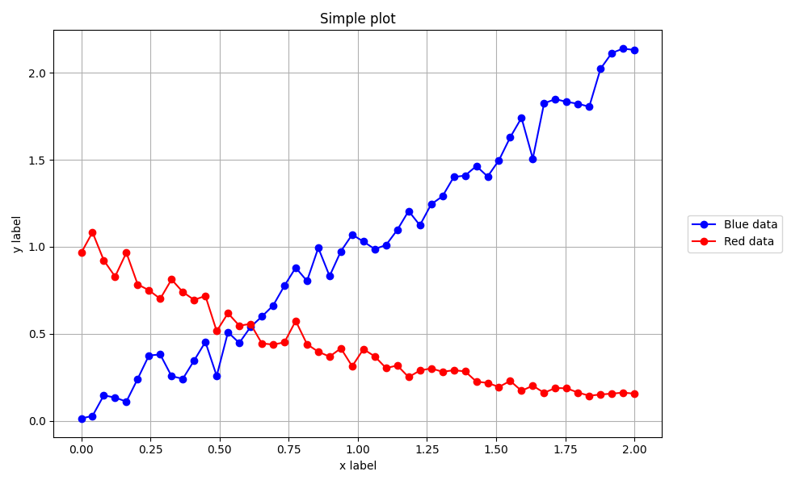
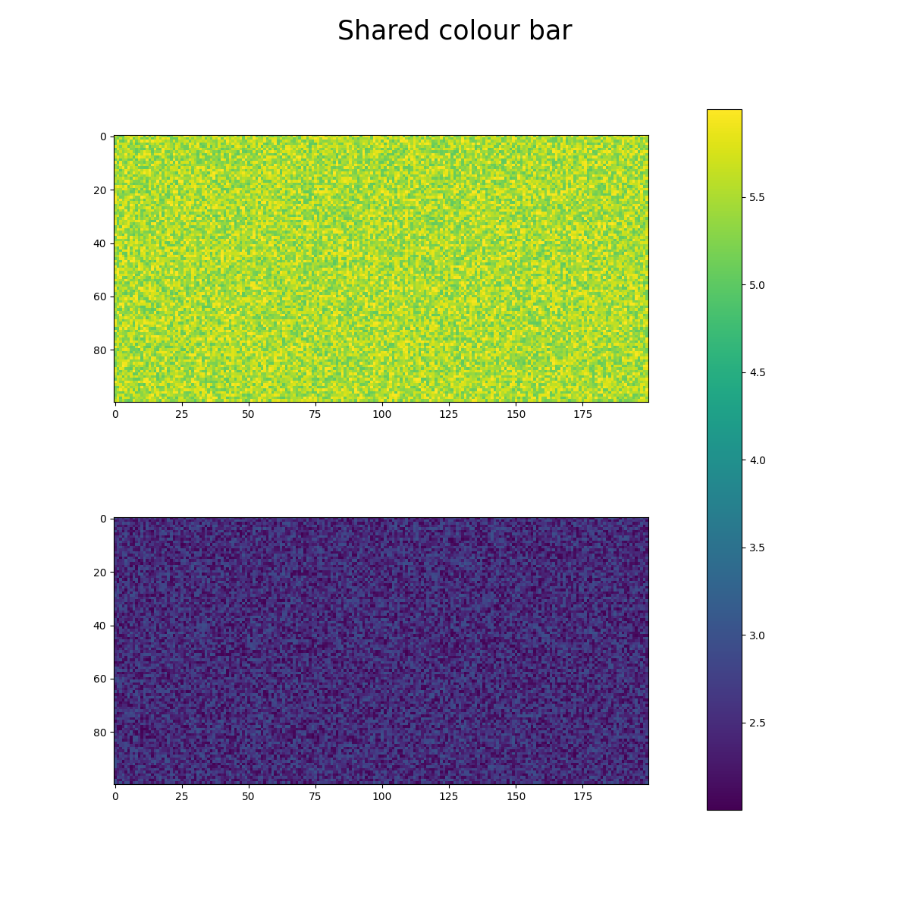

# jutility

Collection of Python utilities intended to be useful for machine learning research and experiments.


## Contents

- [jutility](#jutility)
  - [Contents](#contents)
  - [Install with `pip`](#install-with-pip)
  - [Usage examples](#usage-examples)
    - [`plotting`](#plotting)
      - [Making a simple plot](#making-a-simple-plot)
      - [Shared colour bar](#shared-colour-bar)
    - [`util`](#util)
    - [`sweep`](#sweep)
  - [Unit tests](#unit-tests)
  - [Build package locally](#build-package-locally)
  - [Updating package on PyPI](#updating-package-on-pypi)

## Install with `pip`

The `jutility` package is available as [a Python package on PyPI](https://pypi.org/project/jutility/), and can be installed with `pip` using the following commands:

```
python -m pip install -U pip
python -m pip install -U jutility
```

## Usage examples

### `plotting`

#### Making a simple plot

```python
import numpy as np
from jutility import plotting

rng = np.random.default_rng(0)
x = np.linspace(0, 2)
f = lambda x: x + 0.1 * rng.normal(size=x.shape)

plotting.plot(
    plotting.Line(x, f(x), c="b", marker="o", label="Blue data"),
    plotting.Line(x, np.exp(-f(x)), c="r", marker="o", label="Red data"),
    axis_properties=plotting.AxisProperties("x label", "y label"),
    legend=True,
    plot_name="Simple plot",
    dir_name="images",
)
```



*More simple examples coming soon*

#### Shared colour bar

```python
import numpy as np
from jutility import plotting

rng = np.random.default_rng(0)
z1 = rng.random((100, 200)) + 5
z2 = rng.random((100, 200)) + 2
v_min = min(z1.min(), z2.min())
v_max = max(z1.max(), z2.max())

colour_bar = plotting.ColourBar(v_min, v_max)

mp = plotting.MultiPlot(
    plotting.ImShow(c=z1, vmin=v_min, vmax=v_max),
    colour_bar,
    plotting.ImShow(c=z2, vmin=v_min, vmax=v_max),
    colour_bar,
    figure_properties=plotting.FigureProperties(
        num_rows=2,
        num_cols=2,
        width_ratios=[1, 0.2],
        tight_layout=False,
        title="Shared colour bar",
    ),
)
mp.save("Shared colour bar", dir_name="images")
```



*More complex examples coming soon*

### `util`

*Coming soon*

### `sweep`

*Coming soon*

(in the meantime, see [`scripts/make_logo.py`](scripts/make_logo.py) which made the logo above, and [unit tests](tests/) for [`util`](tests/test_util.py), [`plotting`](tests/test_plotting.py), and [`sweep`](tests/test_sweep.py))

## Unit tests

To run all unit tests, install [`pytest`](https://pypi.org/project/pytest/) (these tests have previously been run with `pytest` version 5.4.1), and run the following command (at the time of writing, this takes about 17 seconds to run 42 unit tests, because several unit tests involve saving images or GIFs to disk):

```
pytest
```

## Build package locally

`jutility` can be built and installed locally using the following commands, replacing `$WHEEL_NAME` with the name of the wheel built by the `python -m build` command (for example, `jutility-0.0.5-py3-none-any.whl`):

```
python -m build
python -m pip install --force-reinstall --no-deps dist/$WHEEL_NAME
```

## Updating package on PyPI

This package was uploaded to PyPI following [the Packaging Python Projects tutorial in the official Python documentation](https://packaging.python.org/en/latest/tutorials/packaging-projects/).

To update PyPI with a newer version, update the `version` tag in [`setup.cfg`](setup.cfg), and then use the following commands:

```
rm -rf dist/*
python -m build
python -m twine upload dist/*
```

When prompted by `twine`, enter `__token__` as the username, and paste an API token from the [PyPI account management webpage](https://pypi.org/manage/account/) as the password (including the `pypi-` prefix).
