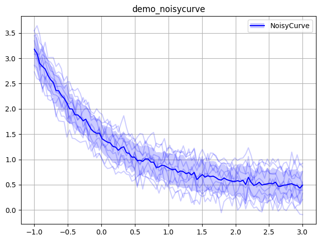

# jutility

A Judicious collection of Python Utilities (including CLI configuration, plotting, and tables) and component of the [JUML](https://github.com/jakelevi1996/juml) framework.


## Contents

- [jutility](#jutility)
  - [Contents](#contents)
  - [Install with `pip`](#install-with-pip)
  - [Usage examples](#usage-examples)
    - [`plotting`](#plotting)
      - [`plotting.NoisyCurve`](#plottingnoisycurve)

## Install with `pip`

The `jutility` package is available as [a Python package on PyPI](https://pypi.org/project/jutility/), and can be installed with `pip` using the following commands:

```
python -m pip install -U pip
python -m pip install -U jutility
```

The `jutility` package can be installed with the latest updates from GitHub:

```
python -m pip install -U pip
python -m pip install git+https://github.com/jakelevi1996/jutility.git --force-reinstall --no-deps
```

Alternatively, `jutility` can be installed in "editable mode" from the [GitHub repository](https://github.com/jakelevi1996/jutility):

```
git clone https://github.com/jakelevi1996/jutility.git
python -m pip install -U pip
python -m pip install -e ./jutility
```

The installation can be verified with the following snippet, for example in a [Google Colab notebook](https://colab.research.google.com/):

```python
from jutility import plotting

plotting.plot(
    plotting.Line([1, 2, 4], [1, 3, 2], c="r", m="o"),
    show=True,
)
```

## Usage examples

*Outdated; TODO*

(in the meantime, see [`scripts/make_logo.py`](scripts/make_logo.py) which made the logo above, and [unit tests](tests/) for [`util`](tests/test_util.py), [`plotting`](tests/test_plotting.py), and [`cli`](tests/test_cli.py))

### `plotting`

#### `plotting.NoisyCurve`

See [`scripts/demo_noisycurve.py`](scripts/demo_noisycurve.py):

```python
import numpy as np
from jutility import plotting, util

rng = np.random.default_rng(0)

nc = plotting.NoisyCurve()

n = 100
x = np.linspace(-1, 3, n)

for i in range(10):
    y = np.exp(-x) + rng.normal(0, 0.1, n) + 0.1*i
    nc.update(y)

nc_plot = nc.plot(x, label="NoisyCurve")

plotting.plot(
    nc_plot,
    plotting.Legend.from_plottables(nc_plot),
    plot_name="demo_noisycurve",
    dir_name="images",
)
```


